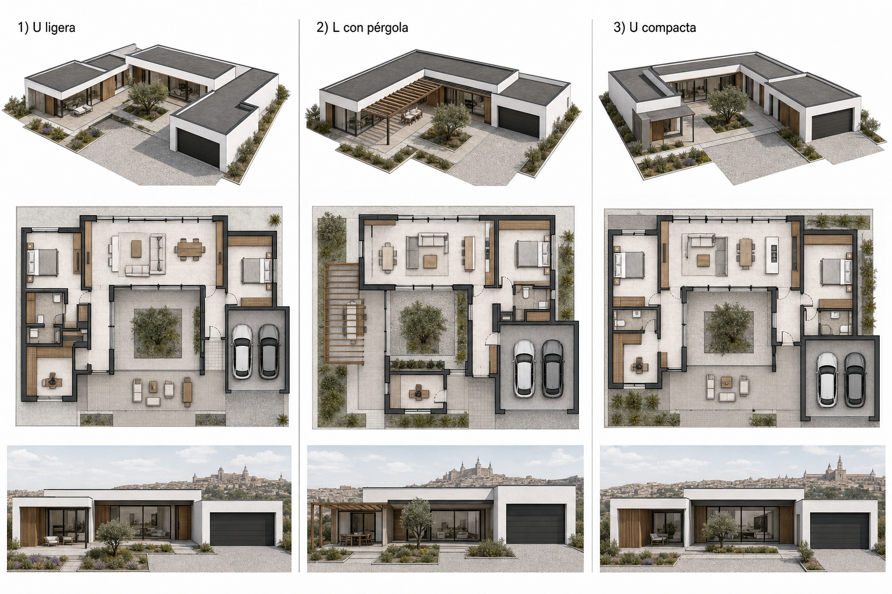

# Villa Layos

Proyecto de diseño, planificacion y desarrollo de una vivienda unifamiliar industrializada en Layos Golf, Toledo.

## Objetivo

Diseñar una vivienda de retiro moderna, minimalista, eficiente, comoda y de bajo mantenimiento, con presupuesto maximo inicial de 300.000 EUR.

## Criterios Confirmados

- Localizacion objetivo: urbanizacion Layos Golf, Toledo.
- Vivienda de una sola planta.
- Superficie interior objetivo: 100-120 m2.
- Presupuesto maximo inicial: 300.000 EUR.
- Estetica: blanco, gris, negro, cristal y acentos calidos tipo madera o similar.
- Salon amplio con gran ventanal y conexion visual al porche.
- Dormitorio principal con bano propio.
- Dormitorio de invitados.
- Habitacion suplementaria para despacho y estudio de sonido, sin aislamiento acustico extremo.
- Garaje anexo para dos vehiculos, con entrada directa a vivienda.
- Trastero y posible zona de gimnasio vinculada al garaje.
- Porches amplios con buena sombra.
- Exterior de mantenimiento minimo, preferentemente pavimentado o con soluciones secas.
- Prioridad alta: eficiencia energetica, climatizacion y confort acustico general.
- Piscina no prioritaria; si se incorpora, sera pequena, ornamental y de refresco.

## Concepto Actual

La linea principal de trabajo es una **U ligera**: una vivienda compacta de una planta donde la casa y el garaje/anexo forman un patio protegido con grandes porches. Esta estrategia conserva la sensacion espacial de vivienda en U sin disparar los metros interiores ni el coste.

Alternativas en estudio:

1. U ligera.
2. L con pergola que simula una U.
3. U compacta.

## Estructura del Repositorio

- [AGENTS.md](AGENTS.md): memoria operativa e instrucciones del proyecto.
- [docs/00-brief-vivo.md](docs/00-brief-vivo.md): requisitos, deseos, dudas y criterios vivos.
- [docs/01-programa-superficies.md](docs/01-programa-superficies.md): superficies objetivo y control de m2.
- [docs/02-alternativas-implantacion.md](docs/02-alternativas-implantacion.md): comparativa U ligera, L con pergola y U compacta.
- [docs/03-presupuesto-preliminar.md](docs/03-presupuesto-preliminar.md): primer marco economico.
- [docs/04-sistemas-constructivos.md](docs/04-sistemas-constructivos.md): comparativa de sistemas industrializados.
- [docs/05-registro-decisiones.md](docs/05-registro-decisiones.md): decisiones tomadas y pendientes.
- [docs/06-analisis-catastro-parcela.md](docs/06-analisis-catastro-parcela.md): lectura tecnica inicial de la parcela catastral candidata.
- [docs/07-concepto-vivienda-dos-alas.md](docs/07-concepto-vivienda-dos-alas.md): concepto de vivienda unifamiliar flexible con dos zonas privadas.
- [docs/08-seccion-conceptual-pendiente.md](docs/08-seccion-conceptual-pendiente.md): seccion conceptual con acceso y garaje en cota alta.
- [docs/09-lectura-dxf-catastro.md](docs/09-lectura-dxf-catastro.md): lectura de DXF/ASC descomprimidos y contexto catastral.
- [docs/10-topografia-parcela.md](docs/10-topografia-parcela.md): vision topografica preliminar con MDT05 IGN/CNIG.

## Proximos Pasos

1. Cerrar el programa de superficies de la vivienda.
2. Definir tres esquemas de planta para vivienda unifamiliar de dos alas.
3. Contrastar la parcela candidata con normativa urbanistica de Layos Golf.
4. Comparar sistemas constructivos viables para el presupuesto.
5. Preparar una estrategia energetica por fases.
