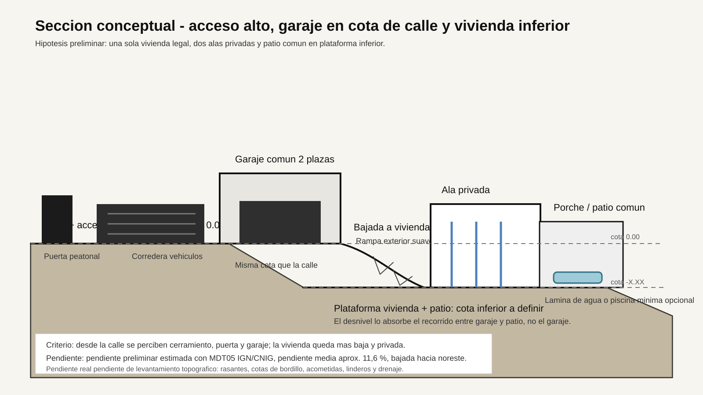

# Seccion Conceptual - Acceso Alto Y Vivienda Inferior

Fecha: 2026-07-23.

## Idea Del Promotor

La calle, la puerta peatonal, la corredera de vehiculos y el garaje se entienden en el mismo plano de acceso, sin desnivel relevante entre ellos.

El desnivel de la parcela se absorbe despues, en la bajada desde garaje/acceso hasta la plataforma de vivienda y patio.

Esto significa que desde la calle se veria principalmente:

- cerramiento;
- puerta peatonal;
- puerta corredera de vehiculos;
- garaje comun;
- poca o ninguna vision directa de la vivienda principal.

La vivienda quedaria mas baja, mas privada y vinculada al patio comun.

## Esquema Visual



## Seccion Conceptual En Texto

```text
CALLE / COTA ALTA
--------------------------------------------------------
Puerta peatonal     Corredera vehiculos     Garaje comun
                                       2 plazas cota 0.00
--------------------------------------------------------
                         \
                          \
                           \ bajada a vivienda/patio
                            \
                             ---------------------------
                             Plataforma inferior
                             Vivienda en U ligera
                             Dos alas privadas
                             Patio/porches comunes
                             ---------------------------
```

## Criterio Arquitectonico

Esta estrategia es muy adecuada para una parcela inclinada porque convierte la pendiente en privacidad.

Ventajas:

- El garaje queda comodo, directamente conectado a la calle.
- La vivienda se protege visualmente respecto a la calle.
- La llegada a la casa puede convertirse en una secuencia arquitectonica interesante.
- El patio inferior puede ser mucho mas privado y controlado.
- La casa en U ligera cobra mas sentido: abraza una plataforma comun inferior.

## Puntos Tecnicos Criticos

- El salto entre garaje y vivienda debe ser accesible o prever accesibilidad futura.
- El recorrido de bajada debe resolver evacuacion de agua y escorrentias.
- Hay que evitar muros de contencion grandes, porque encarecen mucho.
- La cota inferior exacta no debe decidirse sin topografia.
- El garaje puede actuar como pieza de contencion parcial, pero hay que estudiarlo estructuralmente.

## Opciones Para La Bajada

| Solucion | Ventaja | Riesgo |
|---|---|---|
| Rampa exterior suave | Accesible y comoda | Necesita longitud suficiente |
| Escalera exterior + prevision de plataforma elevadora | Compacta y economica inicialmente | Menos comoda a largo plazo |
| Recorrido en zigzag | Integra paisajismo seco y suaviza pendiente | Ocupa mas superficie |
| Pasarela ligera desde garaje | Muy arquitectonica | Puede encarecer estructura |

## Recomendacion Actual

Trabajar con la siguiente hipotesis:

**Garaje en cota de calle, vivienda y patio en plataforma inferior, bajada controlada entre ambos niveles, y la vivienda parcialmente oculta desde la calle.**

En la siguiente fase hace falta dibujar una planta/seccion combinada con la parcela real y probar tres posiciones:

1. Garaje centrado en el frente de acceso.
2. Garaje desplazado a un lateral para liberar entrada peatonal mas noble.
3. Garaje como pieza-puente o pieza-muro, aprovechando la pendiente para trastero/gimnasio inferior.
