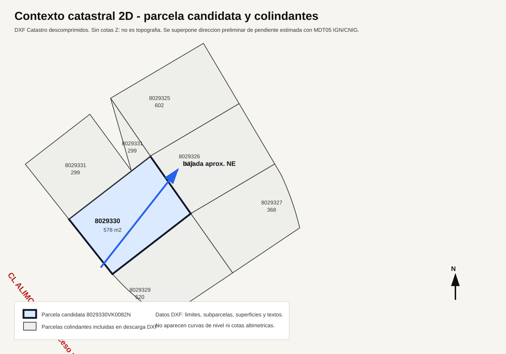

# Lectura DXF/ASC Catastro

Fecha: 2026-07-24.

## Objetivo

Revisar los archivos `.dxf` y `.asc` descomprimidos de Catastro para comprobar si aportan informacion nueva sobre la topografia, pendiente o contexto geometrico de la parcela.

## Resultado Principal

Los DXF descomprimidos **no contienen topografia real**.

No aparecen:

- cotas Z significativas;
- curvas de nivel;
- puntos altimetricos;
- rasantes de calle;
- pendientes;
- perfiles longitudinales o transversales.

Lo que si contienen:

- limites 2D de parcela;
- parcelas colindantes incluidas en la descarga;
- subparcelas o elementos catastrales;
- textos de uso/superficie;
- algunos textos de medicion de lados en el DXF de la referencia completa;
- rotulo de calle `CL ALIMOCHE, 49`.

## Vista De Contexto

Se ha generado una visualizacion de contexto a partir de los DXF descomprimidos:

Esta imagen sirve para entender la posicion relativa de la parcela respecto a las colindantes incluidas en la descarga, no para fijar cotas de proyecto.

## Capas DXF Relevantes

| Capa | Lectura probable |
|---|---|
| `PG-LP` | Lineas de parcela/limite parcelario |
| `PG-AA` | Texto descriptivo de uso/subparcela |
| `PG-AS` | Texto de superficie asociada |
| `PG-LI` | Lineas interiores o elementos de construccion en parcelas colindantes |
| `PG-CO` | Cotas o textos de medicion en el croquis |
| `PG-TL` | Texto de localizacion/calle |

## Archivos Revisados

| Archivo | Informacion util |
|---|---|
| `8029330VK0082N/8029330VK0082N.dxf` | Parcela objetivo, texto `SUELO`, superficie `578`, sin cotas Z. |
| `8029330VK0082N-2/...` | Parcelas de contexto: 8029325, 8029326, 8029327, 8029329, 8029330 y 8029331. |
| `8029330VK0082N0001UD/8029330VK0082N0001UD.dxf` | Parcela objetivo con textos de medicion de lados: 29,38 m; 20,06 m; 28,26 m; 20,07 m; texto `CL ALIMOCHE, 49`. |
| Archivos `.asc` | Metadatos catastrales basicos: provincia, municipio, referencia, superficie y construccion. |

## Parcelas De Contexto Incluidas

| Referencia | Superficie/lectura textual en DXF |
|---|---:|
| 8029330VK0082N | 578 m2 |
| 8029331VK0082N | 602 m2, con elementos construidos/subparcelas |
| 8029329VK0082N | 520 m2 |
| 8029325VK0082N | 602 m2 |
| 8029326VK0082N | 573 m2 |
| 8029327VK0082N | 518 m2 en ASC; DXF con varias subzonas/textos |

## Implicacion Para La Vision Topografica

La informacion descomprimida mejora la lectura de contexto, pero no cambia la conclusion topografica:

- Catastro sirve para forma, superficie y contexto catastral.
- El MDT05 del IGN/CNIG sirve para una estimacion preliminar de pendiente.
- El proyecto necesita levantamiento topografico si la compra avanza.

La estrategia de diseño sigue siendo valida:

**acceso y garaje en cota alta de calle; vivienda y patio en plataforma inferior; bajada controlada absorbiendo el desnivel.**

## Siguiente Uso De Esta Informacion

La vista de contexto debe usarse en la siguiente fase para probar tres implantaciones:

1. Garaje centrado en el frente de acceso.
2. Garaje desplazado a un lateral.
3. Garaje como pieza de contencion/puente, con posible aprovechamiento inferior para trastero o gimnasio.
