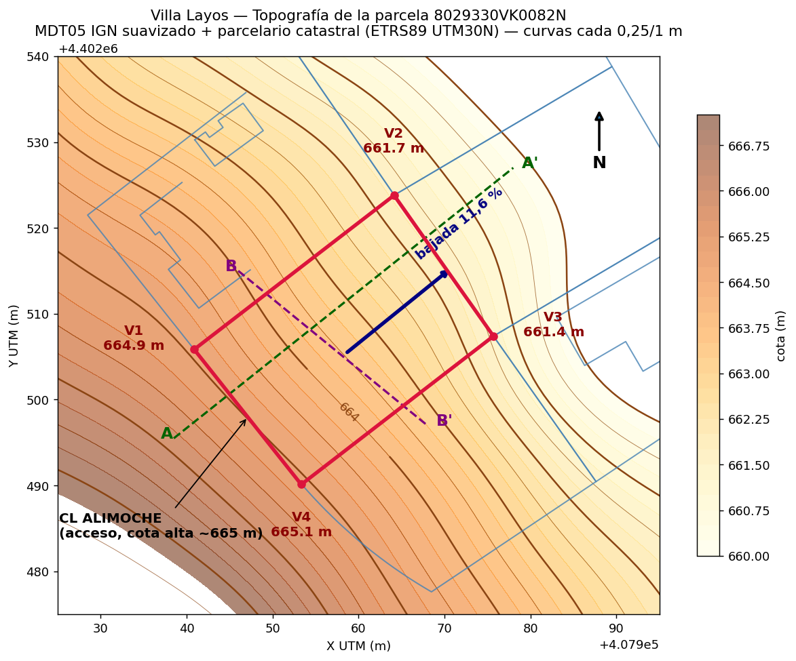
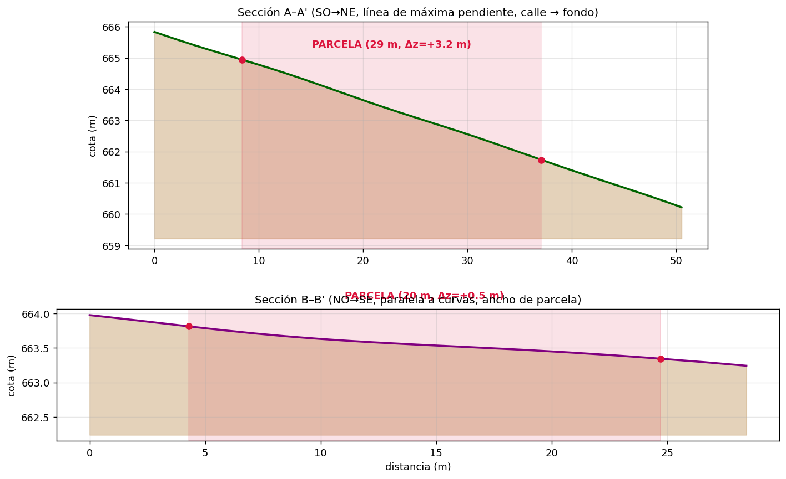
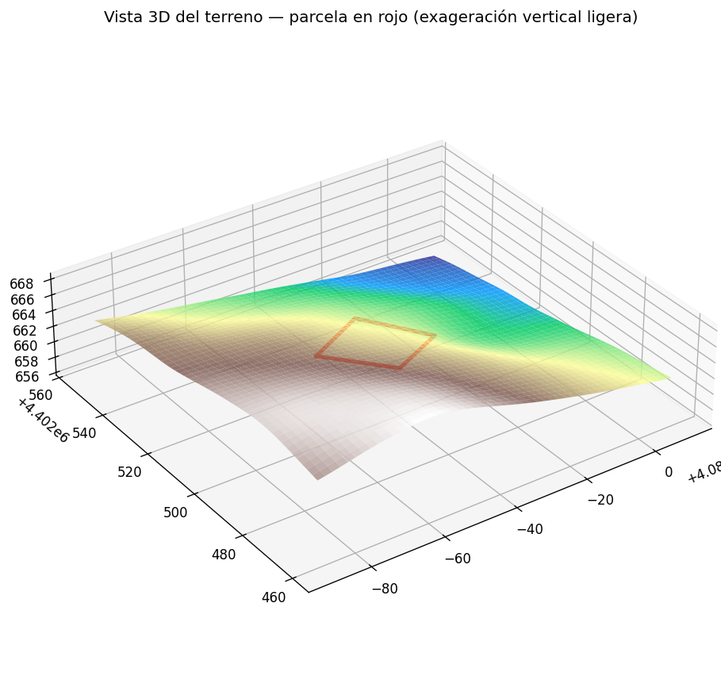
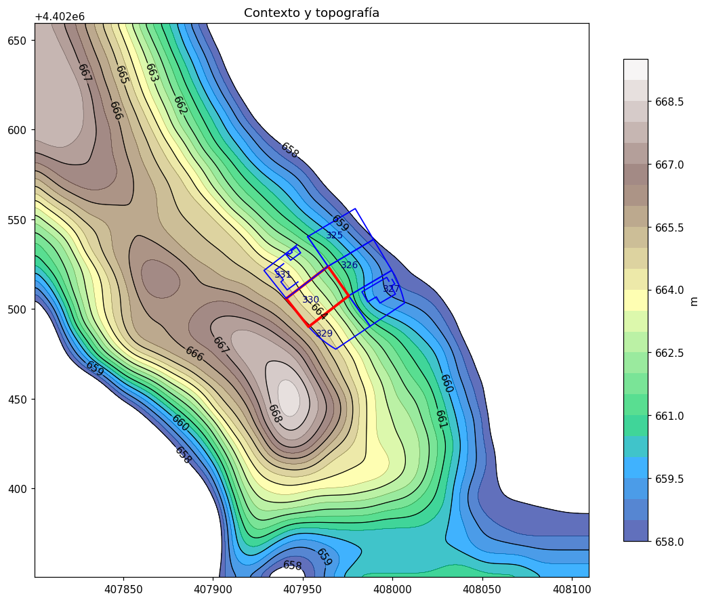

# Vision Topografica de la Parcela - 8029330VK0082N

Fecha de analisis: 2026-07-24.

## Fuentes y Metodo

La cartografia catastral descargada (GML INSPIRE, DXF, KML) es estrictamente 2D: define linderos con precision, pero no contiene cotas. Segun el documento de ayuda del visor de la Sede Electronica del Catastro, los DXF/GML del visor reproducen el parcelario a la escala de captura, sin altimetria.

Para la altimetria se ha combinado:

1. **Geometria oficial de linderos**: GML INSPIRE de la parcela y DXF de las 6 parcelas del entorno (8029325, 8029326, 8029327, 8029329, 8029330, 8029331), en ETRS89 / UTM 30N (EPSG:25830).
2. **Modelo Digital del Terreno MDT05 del IGN/CNIG**: cobertura `Elevacion25830_5` del servicio WCS oficial (servicios.idee.es), descargada en una ventana de 310 x 310 m centrada en la parcela. Malla de 5 m, valores en metros enteros, suavizada con filtro gaussiano y remuestreada a 1 m para eliminar el escalonado y poder trazar curvas cada 0,25 m.
3. **Croquis FXCC 1:250 y fotografia catastral**: confirman que el acceso y el frente de calle (CL Alimoche 49) estan en el lado suroeste, y que la parcela cae por debajo de la rasante de la calle hacia el noreste.

**Precision**: el MDT05 tiene resolucion de 5 m y precision altimetrica del orden de +/-0,5-1 m en absoluto. Los gradientes relativos (pendiente, direccion de caida, desniveles internos) son fiables a nivel de anteproyecto. **No sustituye al levantamiento topografico** exigible antes de proyecto basico.

## Resultados Principales

| Dato | Valor |
|---|---|
| Cota vertice V1 (oeste, esquina calle) | ~664,9 m |
| Cota vertice V2 (norte) | ~661,7 m |
| Cota vertice V3 (este, punto mas bajo) | ~661,4 m |
| Cota vertice V4 (sur, esquina calle, punto mas alto) | ~665,1 m |
| Cota centro de parcela | ~663,5 m |
| Desnivel total dentro de parcela | **~3,6 m** |
| Pendiente media (plano ajustado, 579 puntos) | **11,6 %** (6,6 grados) |
| Direccion de bajada | **azimut ~51 grados (noreste)** |
| Pendiente transversal (paralela a la calle) | ~2,5 % |

Lectura clave: **la pendiente es casi perfectamente perpendicular al frente de calle**. La calle Alimoche discurre por la parte alta (lado SO, cota ~665) y la parcela cae de forma muy uniforme hacia el lindero NE (cota ~661,4), sin vaguadas, crestas ni irregularidades apreciables dentro del solar. Es una ladera limpia orientada al NE.

Contexto: la parcela esta en la ladera NE de una loma que culmina a ~668 m al SO (detras de la calle). Hacia el NE el terreno sigue bajando hasta una vaguada a ~658 m (previsiblemente zona de golf/espacio libre), lo que sugiere **vistas despejadas hacia el NE** y sin obstrucciones solares importantes por el este.

## Secciones

- **Seccion A-A' (SO-NE, maxima pendiente)**: dentro de la parcela, caida continua de ~3,2 m en 29 m. Sin quiebros.
- **Seccion B-B' (NO-SE, paralela a la calle)**: practicamente llana, ~0,5 m en 20 m.

Imagenes en `visualizaciones/2026-07-24/`:

- `fig1_plano_topografico.png`: plano de curvas de nivel (0,25/1 m) con parcelario, cotas de vertices, frente de calle y flecha de pendiente.
- `fig2_secciones.png`: secciones A-A' y B-B'.
- `fig3_vista3d.png`: vista 3D del terreno con la parcela.
- `context_topo.png`: topografia del entorno amplio (310 x 310 m).

### Plano topografico

### Secciones

### Vista 3D

### Contexto amplio

## Implicaciones Directas Para el Diseno

1. **Acceso y garaje en cota alta (calle)**: confirma la estrategia del doc 08. El garaje puede apoyarse en la rasante de calle (~665) con excavacion minima.
2. **Escalonado natural en la direccion corta**: con 11,6 % en 29 m de fondo, una vivienda de un solo nivel apoyada en una unica plataforma exigiria desmontes/terraplenes de ~1,5-1,8 m en los extremos. Escalonar la casa en 2 plataformas (salto de ~1,2-1,5 m) reduce mucho movimiento de tierras y muros.
3. **Orientacion**: el frente de calle SO recibe el sol de tarde; la caida NE da las vistas y la luz de manana. El gran ventanal del salon hacia NE tiene vistas y luz suave (sin sobrecalentamiento), pero el soleamiento de invierno principal vendra del SE-SO: conviene capturar sur en el patio.
4. **Drenaje favorable**: la parcela evacua de forma natural hacia el lindero NE; la plataforma de la casa debe proteger de la escorrentia que llega desde la calle (lado alto).
5. **Semisotano/bancada tecnica**: el desnivel de 3,6 m permite, si la normativa lo autoriza, un semisotano o trastero enterrado hacia la calle y abierto hacia el NE con coste de contencion moderado.

## Datos Adicionales del DXF del Inmueble (0001UD)

El DXF de la referencia completa `8029330VK0082N0001UD` (descomprimido el 2026-07-24) añade sobre el DXF de parcela:

- **Coordenadas de linderos con precision milimetrica** (capa PG-LP), identicas a las del GML.
- **Acotaciones oficiales de los lados** (capa PG-CO): 29,38 m (NO), 20,06 m (NE), 28,26 m (SE) y 20,07 m (SO). Coinciden con las longitudes calculadas; el lado SE incluye el microquiebro de 0,05 m.
- **Rotulo de calle** (capa PG-TL): "CL ALIMOCHE, 49" situado fuera de la parcela junto al lado SO, confirmando el frente de calle en el lado corto alto.
- **Flecha de acceso** (capa PG-LF): situada en torno a X=407943, Y=4402495, es decir, **sobre el frente SO pero en su mitad sur, cerca del vertice V4** (el punto mas alto de la parcela, ~665 m). Es el acceso rodado/peatonal que Catastro identifica, coherente con ubicar garaje y entrada en esa esquina.

## Pendiente de Verificar

- Rasante y bombeo reales de la calle Alimoche (bordillo, acera, acometidas).
- Levantamiento topografico con estacion/GPS-RTK antes de proyecto basico.
- Normativa urbanistica de Layos Golf: retranqueos, ocupacion, alturas medidas desde rasante en parcela inclinada (criterio critico en laderas), muros de contencion y vallados permitidos.
